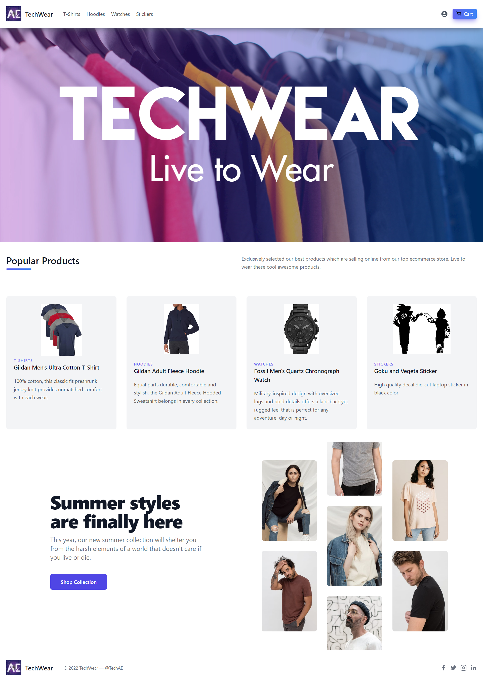

# Ecommerce Platform using NEXTJS and TAILWINDCSS

---

<table align="center">
    <thead align="center">
        <tr border: 1px;>
            <td><b>Project Stats</td>
            <td><b>🌟 Stars</b></td>
            <td><b>🍴 Forks</b></td>
            <td><b>🐛 Issues</b></td>
            <td><b>🔔 Open PRs</b></td>
            <td><b>🔕 Close PRs</b></td>
        </tr>
     </thead>
    <tbody>
         <tr>
            <td><a href="https://github.com/pranjay-poddar/Dev-Geeks"</a>Project</td>
            <td></td>
             <td></td>
            <td></td>
            <td></td>
           <td></td>
        </tr>

Make sure to leave a star ⭐

  

create .env.local and add following configs

MONGO_URI=mongodb://127.0.0.1:27017/db_name

## Tech Stack

**Client:** NextJS, TailwindCSS

**Server:** MongoDB

## Contribution

Check out <a href="/CONTRIBUTING.md">Contribution Document</a>

## Our Contributors

 

Show some ❤️ by starring this awesome repository!

